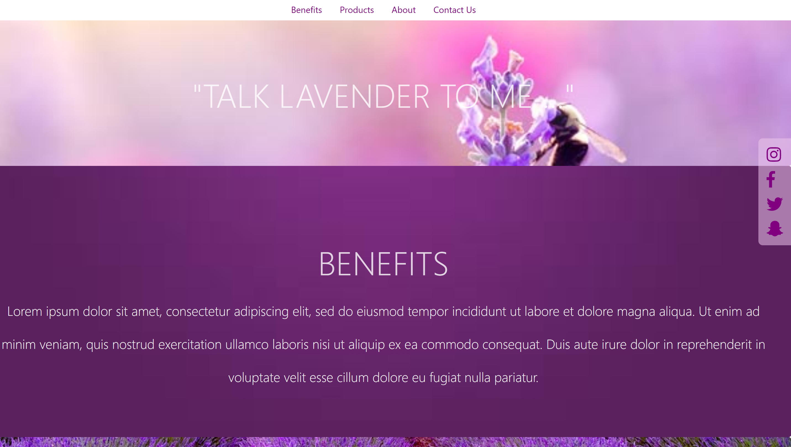

# LancashireLavender.com

## Brief

[LancashireLavender.com](https://LancashireLavender.com)

We were tasked with creating a website to display not only the beauty of lavender but it's sustainability and benefits to people’s health. Show case the ethics behind lavender and the products that are available. Look to use modern design with parallax scrolling efficient navigation and a section about the owners. 

- [See our brief here in full](docs/LancashireLavender.pdf) 

## Our Plan and Design

We began with trello and kanban and started getting our ideas onto our trello and later adding tasks to our kanban. Requested was a wire frame of our design please see [our wireframe](docs/initial_plan.png).

## Future ideas for later versions

- Scroll to from the main nav bar buttons
- Modern scroll bar
- Instagram updates the About section picture collage Instagram API required
- Form to collect customer details on database

## Acknowledgements 

Used in this project are the following libraries:

- Bootstrap
- Font Awesome 
- Google Fonts
- All pictures & video NOT provided by client at the outset
- Logo design courtesy of a friend of a team member

## The Team

- [@Ryan](https://github.com/ryan-farrell)
- [@Yozgyan](https://github.com/Yozgyan)
- [@Carmen](https://github.com/cmcharnley)
- [@Adam](https://github.com/adamnowill)
    